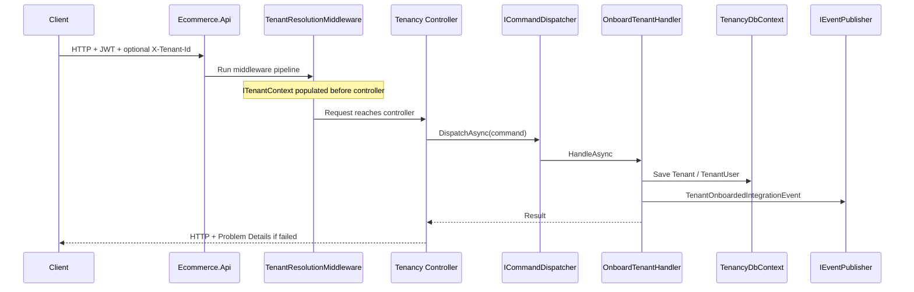

# Tenancy module migration guide

**Module:** Tenancy / Accounts (ADR-0005)
**Role in system:** Tenant lifecycle, membership rows (`TenantUser`), tenant discovery, request-scoped tenant context (`X-Tenant-Id`).
**Prerequisite reading:** [Migration playbook](../migration-playbook-from-layered-monolith-to-modular-monolith.md), [ADR-0005](../adr/0005-modular-monolith-bounded-context-modules.md), [ADR-0001](../adr/0001-multi-tenant-model.md).

This guide is your **hands-on checklist**: what to do, which files are involved, why it matters, and trade-offs. It does not prescribe line-by-line code — you implement; a mentor reviews per phase.

---

## Table of contents

0. [Prerequisite — centralized build and packages](#0-prerequisite--centralized-build-and-packages)
1. [Before you start](#1-before-you-start)
2. [Target end state](#2-target-end-state)
3. [Phase overview](#3-phase-overview)
4. [Phase 0 — Shared kernel (events + dispatchers)](#phase-0--shared-kernel-events--dispatchers)
5. [Phase 1 — Scaffold Tenancy projects](#phase-1--scaffold-tenancy-projects)
6. [Phase 2 — TenancyDbContext](#phase-2--tenancydbcontext)
7. [Phase 3 — Move slices (largest phase)](#phase-3--move-slices-largest-phase)
8. [Phase 4 — Host cleanup](#phase-4--host-cleanup)
9. [Phase 5 — Tests](#phase-5--tests)
10. [Phase 6 — Cross-module contracts](#phase-6--cross-module-contracts)
11. [Definition of done](#definition-of-done)
12. [After Tenancy — next modules](#after-tenancy--next-modules)

---

## 0. Prerequisite — centralized build and packages

Complete **before Phase 0** (already done in this repository if you pulled latest `main`/your branch with these files).

| File | Location |
|------|----------|
| `Directory.Build.props` | `backend/ecommerce-api/` |
| `Directory.Packages.props` | `backend/ecommerce-api/` |
| `.editorconfig` | `backend/ecommerce-api/` (C# under API solution only) |
| `tests/Directory.Build.props` | Imports parent props + `IsPackable=false` |

**Why before migration**

- New `Ecommerce.Tenancy.*` projects inherit `net10.0`, nullable, and analyzers without repeating XML.
- All NuGet versions live in one file — add packages there when Phase 0/1 introduces dependencies.
- `.editorconfig` keeps style consistent; existing block-scoped namespaces may show IDE0161 as **warnings** until you convert files over time.

**Verify**

```powershell
dotnet build backend/ecommerce-api/Ecommerce.slnx
dotnet test backend/ecommerce-api/Ecommerce.slnx
```

**Adding packages during Tenancy work:** edit `Directory.Packages.props` first, then reference without `Version` in the module `.csproj`.

More context: [Playbook 7.1](../migration-playbook-from-layered-monolith-to-modular-monolith.md#71-centralized-build-and-packages-prerequisite).

---

## 1. Before you start

### What already exists (do not reinvent)

| Area | Location | Notes |
|------|----------|--------|
| Centralized build | `backend/ecommerce-api/Directory.Build.props`, `Directory.Packages.props`, `.editorconfig` | Prerequisite — see [0](#0-prerequisite--centralized-build-and-packages) |
| Module shell | `backend/ecommerce-api/src/Modules/Tenancy/Ecommerce.Tenancy.Api/` | `TenancyModule.cs` — feature flag only today |
| Host registry | `backend/ecommerce-api/src/Ecommerce.Api/ModulesRegistry.cs`, `Module.cs` | Calls `AddTenancyModule` / `RegisterTenancyModule` |
| Shared messaging (partial) | `backend/ecommerce-api/src/Shared/Ecommerce.Shared.Core/Messaging/` | `ICommand`, `IQuery`, handlers, dispatchers |
| Shared dispatchers | `backend/ecommerce-api/src/Shared/Ecommerce.Shared.Infrastructure/Messaging/` | `CommandDispatcher` OK; `QueryDispatcher` OK; Calling `HandleAsync` on handler |
| Feature flag | `backend/ecommerce-api/src/Ecommerce.Api/appsettings.json` → `Modules:Tenancy:Enabled` | Default true |

### Mentor workflow

- Complete **one phase** at a time.
- **Verify:** `dotnet build` on `backend/ecommerce-api/Ecommerce.slnx` (or solution); run existing tests where relevant.
- **Commit (optional):** one commit per phase with a message like `feat(tenancy): phase N - <short description>`.
- Share build errors, behavioral regressions, or “Phase N ready for review” before starting the next phase.

### What stays outside Tenancy (for now)

| Concern | Stays in legacy / host until later module |
|---------|-------------------------------------------|
| `User`, Clerk JWT, `IUserResolver`, `ClaimsTransformation` | **Identity** (phase 2 module) |
| `StoreBrand`, `StoreInstance` | **Store Brands**, **Stores** |
| `TenantEntity` base class | Likely **Ecommerce.Domain** until `Result`/primitives move to Shared — `StoreInstance` still inherits it |
| Global EF filter on `TenantEntity` types | **EcommerceDbContext** until Stores migrates — Tenancy context does not own `StoreInstance` |

Splitting **membership authorization** (`TenantMemberAuthorizationService`) fully into Tenancy vs Identity is a design choice in Phase 4/6; Tenancy should own **membership data**; Identity may own **policy registration** later.

---

## 2. Target end state

### Project layout

```text
backend/ecommerce-api/src/Modules/Tenancy/
├── Ecommerce.Tenancy.Core/
├── Ecommerce.Tenancy.Application/
├── Ecommerce.Tenancy.Infrastructure/
└── Ecommerce.Tenancy.Api/
```

### Request flow (after Phase 3+)

*Mermaid sequence diagram — time flows downward; solid arrows are calls, dashed arrows are returns.*

| Participant | Role |
|-------------|------|
| **Client** | Browser or API consumer |
| **Host** | `Ecommerce.Api` — ASP.NET pipeline, auth, module registration |
| **MW** | `TenantResolutionMiddleware` — reads `X-Tenant-Id`, sets scoped tenant context |
| **Ctrl** | Tenancy module controller — HTTP in/out only |
| **Disp** | `ICommandDispatcher` — resolves handler; no business logic |
| **H** | e.g. `OnboardTenantHandler` — use case + persistence + events |
| **Db** | `TenancyDbContext` — tenant tables owned by this module |
| **Pub** | `IEventPublisher` — notifies other modules in-process (later: outbox / broker) |



### HTTP surface (parity — do not break without intent)

| Endpoint (today) | Tenant header | Notes |
|------------------|---------------|--------|
| `POST api/admin/onboarding/tenant` | No (`SkipTenantResolution`) | Creates tenant + owner membership |
| `GET` my tenants | No | Lists tenants for authenticated user |
| `GET api/admin/tenants/{slug}` | Yes (`X-Tenant-Id`) | Slug anti-tamper vs resolved tenant |

---

## 3. Phase overview

| Phase | One-line goal | Build | Behavior change |
|-------|---------------|-------|-----------------|
| **(prep)** | `Directory.Build.props` + CPM + `.editorconfig` | Yes | None — see [0](#0-prerequisite--centralized-build-and-packages) |
| **0** | Shared events + fix dispatchers | Yes | None |
| **1** | Four Tenancy projects + references | Yes | None |
| **2** | `TenancyDbContext` registered | Yes | None (legacy still serves API) |
| **3** | All tenancy behavior in module | Yes | **Yes** — routes/handlers in Tenancy |
| **4** | Host dedup + legacy file removal | Yes | None if Phase 3 correct |
| **5** | Tests colocated / new event test | Yes | None |
| **6** | Document public contracts | Yes | Docs only |

**Phase tracking:** Label commits or PRs as *Phase 0* … *Phase 6* if you want git history to match this guide.

---

## Phase 0 — Shared kernel (events + dispatchers)

### Objective

Introduce **integration event** abstractions and an **in-process publisher**; wire **command/query dispatchers** in DI; fix the query dispatcher bug. No Tenancy move yet.

### Why this phase exists

- **Commands/queries** solve *“run this use case now”* inside the process (MediatR alternative you own).
- **Integration events** solve *“tell the rest of the system something happened”* without referencing another module’s database.
- Learning **both** early avoids painting yourself into a corner where every cross-module call is a synchronous service interface.

### What to add (conceptual)

**`Ecommerce.Shared.Core`**

- `IIntegrationEvent` (`EventId`, `OccurredOn`)
- `IIntegrationEventHandler<TEvent>`
- `IEventPublisher`
- Optional: `IntegrationEventBase` record with generated ids

**`Ecommerce.Shared.Infrastructure`**

- `InProcessEventPublisher` — resolve all handlers for `TEvent`, invoke `HandleAsync` (fail-fast in dev is fine)
- `AddSharedMessaging(IServiceCollection)` — register `ICommandDispatcher`, `IQueryDispatcher`, `IEventPublisher`
- Fix `QueryDispatcher` to call `handler.HandleAsync`, not `DispatchAsync`

### Files to touch

| Action | Path |
|--------|------|
| Extend | `src/Shared/Ecommerce.Shared.Core/` (new `IntegrationEvents/` or `Messaging/` types) |
| Extend | `src/Shared/Ecommerce.Shared.Infrastructure/` (`InProcessEventPublisher`, DI extension) |
| Fix | `src/Shared/Ecommerce.Shared.Infrastructure/Messaging/QueryDispatcher.cs` |
| Register (minimal) | `src/Ecommerce.Api/Program.cs` or wait until Phase 1 `TenancyModule` calls `AddSharedMessaging` — **pick one place** and avoid double registration later |

### Trade-offs

| Choice | Benefit | Cost |
|--------|---------|------|
| Custom dispatchers vs MediatR | Full control, smaller dependency graph | You implement handler registration (scan or manual) |
| In-process events first | Simple debugging, no infra | Handlers run synchronously in same request — not true async yet |
| Fail-fast publisher | Surfaces missing handlers early | One failing handler blocks others unless you add policy later |

### Pitfalls

- Registering handlers twice (host + module).
- Confusing **domain events** (inside aggregate) with **integration events** (cross boundary) — start with integration events only if unsure.
- Using `IEventPublisher` for request/response API flows.

### Verification checklist

- [ ] Solution builds
- [ ] Existing API tests still pass
- [ ] Optional: unit test — publish dummy event, stub handler runs
- [ ] `QueryDispatcher` dispatches a test query end-to-end in a scratch test or Phase 1

### Suggested commit message

`feat(shared): integration events, in-process publisher, and messaging DI`

---

## Phase 1 — Scaffold Tenancy projects

### Objective

Create **Core**, **Application**, **Infrastructure**; wire **solution**, **project references**, and **Tenancy.Api** so the module compiles. **No** behavior move — `TenancyModule` may still be mostly empty except references and `AddSharedMessaging()` if you deferred it from Phase 0.

### Why this phase exists

Validates **dependency direction** and **build graph** before moving code. Catches circular references early.

### Project reference rules (enforce strictly)

```text
Tenancy.Api          → Application, Infrastructure
Tenancy.Application  → Core, Shared.Core, (temporary: Ecommerce.Domain for Result/Error)
Tenancy.Infrastructure → Application, Core, Shared.*
Tenancy.Core         → (minimal — no Application/Infrastructure/module refs)
```

### Files to create / update

| Action | Path |
|--------|------|
| Create projects | `src/Modules/Tenancy/Ecommerce.Tenancy.Core/` |
| | `src/Modules/Tenancy/Ecommerce.Tenancy.Application/` |
| | `src/Modules/Tenancy/Ecommerce.Tenancy.Infrastructure/` |
| Update | `src/Modules/Tenancy/Ecommerce.Tenancy.Api/Ecommerce.Tenancy.Api.csproj` — project references |
| Update | `backend/ecommerce-api/Ecommerce.slnx` — include three new projects |
| Update | `src/Modules/Tenancy/Ecommerce.Tenancy.Api/TenancyModule.cs` — `AddSharedMessaging()`, placeholder registrations |
| Already exists | `src/Ecommerce.Api/Ecommerce.Api.csproj` — reference to `Ecommerce.Tenancy.Api` |
| Already exists | `src/Ecommerce.Api/ModulesRegistry.cs` |

### Trade-offs

| Choice | Benefit | Cost |
|--------|---------|------|
| Temporary reference to `Ecommerce.Domain` | Reuse `Result`/`Error` immediately | Must remove when primitives move to Shared |
| Empty module registrations | Safe incremental build | App still 100% legacy for tenancy |

### Pitfalls

- Application → Infrastructure reference (forbidden).
- Forgetting to add projects to `Ecommerce.slnx` — IDE builds one project but CI builds solution.

### Verification checklist

- [ ] `dotnet build` entire solution
- [ ] App starts; tenancy endpoints still hit **legacy** controllers/services
- [ ] `Modules:Tenancy:Enabled: false` still allows app to start (optional hardening)

### Suggested commit message

`feat(tenancy): scaffold Core, Application, Infrastructure projects`

---

## Phase 2 — TenancyDbContext

### Objective

Introduce **`TenancyDbContext`** owning `Tenant` and `TenantUser` mappings; register in DI with **same connection string** as `EcommerceDbContext`. Legacy code remains **authoritative** for reads/writes until Phase 3.

### Why this phase exists

Establishes **table ownership** and **migration ownership** without breaking running endpoints. Teaches **dual-context** period common in strangler migrations.

### What to implement (conceptual)

- `TenancyDbContext` with `DbSet<Tenant>`, `DbSet<TenantUser>`
- Copy/adapt EF configurations from legacy:
  - `src/Ecommerce.Infrastructure/Persistence/Configurations/TenantConfiguration.cs`
  - `src/Ecommerce.Infrastructure/Persistence/Configurations/TenantUserConfiguration.cs`
- Design-time factory or document `dotnet ef` startup project for migrations
- Register `AddDbContext<TenancyDbContext>` in `TenancyModule` (or Infrastructure extension)

### Files to touch

| Action | Path |
|--------|------|
| Create | `Tenancy.Infrastructure/Persistence/TenancyDbContext.cs` |
| Create | `Tenancy.Infrastructure/Persistence/Configurations/` |
| Create | `Tenancy.Infrastructure/Persistence/Migrations/` (new migration — verify no unintended schema drift) |
| Reference | Legacy migrations under `Ecommerce.Infrastructure/Persistence/Migrations/` (history stays; new migrations from Tenancy context forward) |
| Do **not** remove yet | `EcommerceDbContext` mappings for `Tenant` / `TenantUser` until Phase 3 cutover |

### Trade-offs

| Choice | Benefit | Cost |
|--------|---------|------|
| Dual mapping briefly | Zero downtime mentally — flip in Phase 3 | Risk of two contexts writing same tables if you switch half the repos — **avoid** until cutover |
| Same database | Simple ops, one backup | Cannot scale DB per module yet |
| Tenancy-owned migrations | Clear ownership | Must align snapshot with existing tables (no duplicate create table) |

### Pitfalls

- Two active migration histories applying conflicting DDL for same table.
- Removing `DbSet<Tenant>` from legacy **before** all repos use `TenancyDbContext`.
- Putting `ITenantContext` implementation in Application layer (belongs in Infrastructure).

### Verification checklist

- [ ] Build succeeds
- [ ] App starts with both contexts registered
- [ ] `dotnet ef migrations script` (or equivalent) shows **no** destructive surprise vs current schema
- [ ] Legacy onboarding still works (still uses `EcommerceDbContext`)

### Suggested commit message

`feat(tenancy): add TenancyDbContext and EF configurations`

---

## Phase 3 — Move slices (largest phase)

### Objective

**All** tenant features run through the Tenancy module with **feature parity**: onboarding, get tenant, list my tenants; middleware; CQRS handlers; first **integration event** on onboard.

### Why this phase exists

This is the **strangler cutover** — the module becomes real. You learn vertical slices **inside** a bounded context plus **dispatcher** entry points.

### Move map (legacy → Tenancy)

| Legacy location | Target (suggested) |
|-----------------|------------------|
| `src/Ecommerce.Domain/Tenants/*` | `Tenancy.Core/` |
| `src/Ecommerce.Application/Admin/Tenants/Features/Onboarding/*` | `Tenancy.Application/Features/Onboarding/` — `OnboardTenantCommand`, handler, validator |
| `src/Ecommerce.Application/Admin/Tenants/Queries/GetTenant/*` | `Tenancy.Application/Queries/GetTenant/` |
| `src/Ecommerce.Application/Admin/Tenants/Queries/GetMyTenants/*` | `Tenancy.Application/Queries/GetMyTenants/` |
| `src/Ecommerce.Application/Common/Interfaces/ITenantContext.cs` | `Tenancy.Application/Contracts/` (public) |
| `src/Ecommerce.Infrastructure/Tenancy/TenantContext.cs` | `Tenancy.Infrastructure/` |
| `src/Ecommerce.Infrastructure/Persistence/Repositories/Tenants/**` | `Tenancy.Infrastructure/Persistence/Repositories/` |
| `src/Ecommerce.Api/Controllers/Admin/Tenants/*` | `Tenancy.Api/Controllers/` |
| `src/Ecommerce.Api/Middleware/TenantResolutionMiddleware.cs` | `Tenancy.Api/Middleware/` |
| `src/Ecommerce.Application/Common/Attributes/SkipTenantResolutionAttribute.cs` | `Tenancy.Application` or `Tenancy.Api` |

### Keep in legacy for this phase (unless you have a clear plan)

| Item | Reason |
|------|--------|
| `TenantEntity` in `Ecommerce.Domain/Common/` | Used by `StoreInstance` |
| `TenantMemberAuthorizationService` + handler | Cross-cutting; Phase 4 can register handler; contract may move in Identity migration |
| `EcommerceDbContext` global filters for `TenantEntity` | Still needed for `StoreInstance` |

### CQRS shape (per feature)

For each former `IXxxService`:

1. Define `record` command or query implementing `ICommand<Result<T>>` or `IQuery<Result<T>>`.
2. Implement `ICommandHandler` / `IQueryHandler` with `HandleAsync`.
3. Controller injects `ICommandDispatcher` / `IQueryDispatcher`, maps HTTP → message, maps `Result` → HTTP (existing `HandleResult` patterns in host).
4. Register handlers in DI (assembly scan or explicit).

### Integration event (learning milestone)

| Piece | Suggested location |
|-------|-------------------|
| `TenantOnboardedIntegrationEvent` | `Tenancy.Application/IntegrationEvents/` |
| Publish after successful commit | Inside `OnboardTenantHandler` |
| Sample handler (log / no-op) | `Tenancy.Infrastructure/IntegrationEventHandlers/` or temporary host handler |

**Why publish after success:** integration events represent **facts**. Publishing before commit creates ghost notifications.

**Trade-off:** In-process publisher runs handlers **before** HTTP response completes — acceptable for learning; outbox comes later in playbook ladder.

### DI / module wiring

`TenancyModule.AddTenancyModule` should register:

- `TenancyDbContext`, repositories
- `ITenantContext` → `TenantContext`
- Command/query handlers
- Integration event handlers
- `AddControllers()` for Tenancy assembly if using isolated controller discovery

`RegisterTenancyModule` should:

- Map controllers from Tenancy assembly (if not discovered by host already)
- `UseTenantResolution()` — order: after `UseAuthentication`, before `UseAuthorization` (match current host)

### Pitfalls

- Partial move: some endpoints legacy, some Tenancy — double registration or wrong route wins.
- Namespace churn breaking Swagger or tests — update test projects in Phase 5 if needed, but smoke-test manually in Phase 3.
- Forgetting `[SkipTenantResolution]` on onboarding route.
- `GetTenant` must still validate slug vs `ITenantContext.TenantId` (anti-tamper).

### Verification checklist

- [ ] Build succeeds
- [ ] Onboarding creates tenant (DB row in `Tenants` / `TenantUsers`)
- [ ] Get my tenants returns same shape as before
- [ ] Get tenant with `X-Tenant-Id` works; wrong slug fails as before
- [ ] `TenantOnboardedIntegrationEvent` handler observed (log/test)
- [ ] Remove `Tenant`/`TenantUser` from `EcommerceDbContext` **when** all Tenancy repos use `TenancyDbContext`

### If this phase is too large

Use a feature branch with multiple local commits; milestone for review is **all three flows** working through Tenancy.

### Suggested commit message

`feat(tenancy): move tenant slices to module with CQRS and integration events`

---

## Phase 4 — Host cleanup

### Objective

Host stops duplicating tenancy wiring; delete moved legacy files; fix known gaps (e.g. authorization handler not registered).

### Why this phase exists

Prevents **two sources of truth** for DI and middleware. Makes the module boundary obvious in `Program.cs`.

### Host changes (conceptual)

| Remove / relocate from host | Owner |
|----------------------------|--------|
| `builder.Services.AddTenancy()` | `TenancyModule` |
| `app.UseTenantResolution()` | `RegisterTenancyModule` |
| Legacy tenant DI in `Ecommerce.Application/DependencyInjection.cs` | Tenancy module registration |

| Keep on host | Reason |
|------------|--------|
| `AddInfrastructure()`, `EcommerceDbContext` | Other domains |
| Clerk auth, Serilog, exception handler | Global |
| `AddModules(configuration)` | Composition |

### Files to delete (after confirming no references)

- Legacy paths listed in Phase 3 move map (Domain tenants, Application Admin/Tenants, Infrastructure tenant repos, Api tenant controllers)
- Duplicate interface registrations

### Register authorization gap

Today: `TenantMemberAuthorizationHandler` exists under Application but may not be registered.

- Register in `TenancyModule` or host `AddAuthorization` section — **one place**.
- Ensure `ITenantMemberAuthorizationService` implementation is registered (Infrastructure).

### Trade-offs

| Choice | Benefit | Cost |
|--------|---------|------|
| Middleware in Tenancy.Api | Module owns pipeline slice | Host must call `RegisterTenancyModule` in correct order |
| Deleting legacy before tests (Phase 5) | Cleaner tree | Risky — prefer delete after Phase 3 tests green, consolidate in Phase 5 |

### Verification checklist

- [ ] No duplicate `ITenantContext` registration
- [ ] Single tenant resolution middleware in pipeline
- [ ] Grep for `Admin/Tenants` under legacy — should be empty or only tests pending Phase 5
- [ ] `TenantAdmin` policy works if you have tests for it

### Suggested commit message

`refactor(tenancy): host uses TenancyModule only; remove legacy tenant code`

---

## Phase 5 — Tests

### Objective

All tenancy tests pass against **module** layout; add coverage for **in-process event** publishing.

### Test files to relocate or duplicate (then remove old)

| Current test | Notes |
|--------------|--------|
| `tests/Ecommerce.Application.Tests/Admin/Tenants/**` | Handler/service tests → Tenancy.Application.Tests (new project) or folder |
| `tests/Ecommerce.Api.Tests/Controllers/Admin/Tenants/**` | API tests → reference Tenancy endpoints |
| `tests/Ecommerce.Domain.Tests/Tenants/**` | Move to `Ecommerce.Tenancy.Core.Tests` or keep domain tests with Core |

### New test to add

- **InProcessEventPublisher:** given `TenantOnboardedIntegrationEvent`, handler `HandleAsync` invoked once.
- Optional: onboarding integration test asserts event published (mock `IEventPublisher`).

### Trade-offs

| Choice | Benefit | Cost |
|--------|---------|------|
| New test project per module | Clear boundaries | More csproj maintenance |
| Folder under existing tests | Faster | Weaker boundary story |

### Verification checklist

- [ ] `dotnet test` solution — all green
- [ ] No tests still importing deleted legacy namespaces

### Suggested commit message

`test(tenancy): relocate tests and add integration event coverage`

---

## Phase 6 — Cross-module contracts

### Objective

Document what **other modules may depend on** — not internal Tenancy types. Prepare Identity and Stores migrations.

### Deliverables (docs + minimal code)

Suggested file: `docs/migrations/tenancy-public-contracts.md` (you create when implementing) or section in `Tenancy.Application/README.md`.

**Document:**

| Contract | Purpose | Consumers |
|----------|---------|-----------|
| `ITenantContext` | Resolved `TenantId`, `IsResolved` | Stores, commerce modules, auth handlers |
| `ITenantMembershipChecker` (optional interface) | Role/membership checks without DbContext leak | Identity, authorization |
| `TenantOnboardedIntegrationEvent` | Lifecycle fact | Notifications (future), analytics |
| Future: `ITenantLookup` | Resolve tenant by slug/id without dispatching commands | Admin modules |

**Rules to state explicitly:**

- Do **not** inject `TenancyDbContext` outside Tenancy.Infrastructure.
- Do **not** reference `Tenancy.Core` entities from other modules — use DTOs/contracts.
- Commands like `OnboardTenantCommand` are **internal** to Tenancy unless you deliberately expose application services.

### Trade-offs

| Choice | Benefit | Cost |
|--------|---------|------|
| Narrow public surface | Easier to extract microservice later | More interface boilerplate |
| Other modules call `IQueryDispatcher` on Tenancy queries | Less mapping | Leaks application messages across boundary — prefer dedicated contract interfaces |

### Verification checklist

- [ ] Build still green
- [ ] Contracts doc reviewed (mentor or self)

### Suggested commit message

`docs(tenancy): public contracts for cross-module integration`

---

## Definition of done

Use this before starting Identity module:

- [ ] Four Tenancy projects in solution; references correct
- [ ] Shared: events + dispatchers + `InProcessEventPublisher` working
- [ ] `TenancyDbContext` owns `Tenant` / `TenantUser`; legacy context does not map them
- [ ] Onboarding, GetTenant, GetMyTenants via module handlers + dispatchers
- [ ] `TenantOnboardedIntegrationEvent` published and at least one handler runs
- [ ] `TenancyModule` owns DI + tenant middleware; host has no duplicate tenancy setup
- [ ] Tests green; legacy tenant code removed
- [ ] Public contracts documented for next modules

---

## After Tenancy — next modules

Use the same **phase rhythm**; see playbook section “Roadmap after Tenancy.”

| Next | Guide (to create) | Phase 0 special? |
|------|-------------------|------------------|
| **Identity** | `02-identity-module.md` | Usually skip Shared work unless extending events |
| **Store Brands** | `03-store-brands-module.md` | Global module — no `ITenantContext` on APIs |
| **Stores** | `04-stores-module.md` | Depends on Tenancy contracts + Store Brands |

**Event ladder (repository-wide, not Tenancy-only):** after Tenancy + Stores emit events → outbox → idempotent handlers → optional message broker. See [Event-driven maturity ladder](../migration-playbook-from-layered-monolith-to-modular-monolith.md#9-event-driven-maturity-ladder) in the migration playbook.

---

## Quick reference — legacy files (pre-migration)

Use during Phase 3–4 to ensure nothing is left behind:

<details>
<summary>Domain & application</summary>

- `src/Ecommerce.Domain/Tenants/Tenant.cs`
- `src/Ecommerce.Domain/Tenants/TenantUser.cs`
- `src/Ecommerce.Domain/Tenants/TenantRoles.cs`
- `src/Ecommerce.Domain/Tenants/TenantErrors.cs`
- `src/Ecommerce.Domain/Tenants/TenantUserErrors.cs`
- `src/Ecommerce.Application/Admin/Tenants/**`
- `src/Ecommerce.Application/Common/Interfaces/ITenantContext.cs`
- `src/Ecommerce.Application/Common/Interfaces/ITenantMemberAuthorizationService.cs`
- `src/Ecommerce.Application/Common/Authorization/**` (membership-related)

</details>

<details>
<summary>Infrastructure & API</summary>

- `src/Ecommerce.Infrastructure/Tenancy/TenantContext.cs`
- `src/Ecommerce.Infrastructure/Authorization/TenantMemberAuthorizationService.cs`
- `src/Ecommerce.Infrastructure/Persistence/Repositories/Tenants/**`
- `src/Ecommerce.Infrastructure/Persistence/Configurations/Tenant*.cs`
- `src/Ecommerce.Api/Controllers/Admin/Tenants/**`
- `src/Ecommerce.Api/Middleware/TenantResolutionMiddleware.cs`
- `src/Ecommerce.Api/Extensions/ServiceCollectionExtensions.cs` (`AddTenancy`)

</details>

<details>
<summary>Tests</summary>

- `tests/Ecommerce.Application.Tests/Admin/Tenants/**`
- `tests/Ecommerce.Api.Tests/Controllers/Admin/Tenants/**`
- `tests/Ecommerce.Domain.Tests/Tenants/**`

</details>

---

*Aligns with [migration playbook](../migration-playbook-from-layered-monolith-to-modular-monolith.md) and ADR-0005. Update this guide when you discover repo-specific lessons worth keeping.*
